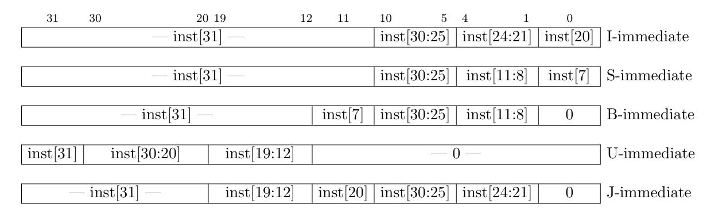

# RV32I Pipelined Processor with Instruction Cache

## Overview

This repository contains an implementation of a RISC-V 32-bit (RV32I) pipelined processor with an instruction cache on FPGA board (Xilinx Basys3). The design aims to explore pipelining concepts, improve instruction fetch performance, and demonstrate basic cache implementation. It supports all instructions defined in the RV32I base ISA.

Note: `RV32I_Top.v` contains the top level RTL for this processor. 


## Directory Structure

```plaintext
.
├── src/
│   ├── RV32I_Top.v               # Main pipeline processor module
|   ├── RV32I_core.v              # Main pipeline processor module
|   ├── RV32I-header.vh           # Main pipeline processor module
|   ├── BASEREG.v                 # Main pipeline processor module
|   ├── DATA_MEMORY.v             # Main pipeline processor module
|   ├── DECODE.v                  # Main pipeline processor module
|   ├── EXECUTE.v                 # Main pipeline processor module
|   ├── FETCH.v                   # Main pipeline processor module
|   ├── MEMORY-STAGE.v            # Main pipeline processor module
|   ├── WRITEBACK.v               # Main pipeline processor module
│   ├── FORWARDING_UNIT.v         # Instruction cache implementation
│   ├── ICACHE.v                  # Hazard detection and control logic
│   ├── INSTRUCTION_MEMORY.v      # Arithmetic Logic Unit
│   ├── cache_sram.v              # Register file implementation
│   ├── dff2_sync.v               # Data memory
|   ├── switch_debounce.v         # Main pipeline processor module
│   └── segment7_control.v        # Helper modules (e.g., muxes, sign extend)
├── testbench/
│   ├── tb_pipeline.v          # Testbench for the pipelined processor
│   ├── tb_instr_cache.v       # Testbench for the instruction cache
│   └── test_programs/         # Sample RISC-V programs for testing
├── docs/
│   ├── design_spec.md         # Detailed design documentation
│   └── pipeline_diagram.png   # Pipeline structure diagram
├── Makefile                   # Makefile for compiling and simulating
├── LICENSE                    # Project license
└── README.md                  # Project documentation

```
## Architecture 

This is the Architecture of 5 Stage pipeline RISCV processor. 


## Features

- **5-Stage Pipeline**:
  - `Instruction Fetch (IF)`: In this stage address to instruction memory (ICACHE) is given and next PC is generated. In case of stall, previous PC (Instruction) is halted and clock enable goes low. 
  - `Instruction Decode (ID)`: In this stage the instruction is decoded and ALU control signals are generated. Immidiate assembly also takes place here. 
  - `Instruction Execute (EX)`: ALU operations takes place on the operands either coming from ID stage or from forwarding. Implementation of various instructions like AUIPC and LUI takes place here. Branch, JAL/JALR target address generation logic is also there in EX stage. 
  - `Memory Access (MEM)`: The processor access the Data Memory in this stage with 1 cycle READ LATENCY. 
  - `Write Back (WB)`: Register File updates takes place in this stage. 
- **Instruction Cache**:
  - Configurable size and associativity: CACHE_SIZE and BLK_SIZE size are parameterised for the direct mapped cache 
  - Simple cache replacement policy.
- **Hazard Handling**:
  - Data forwarding for reducing stalls: Forwarding is done for 3 paths: `MEM->EX`, `WB->EX` and `WB->MEM` stage. 
    Pipeline is stall if load instruction in MEM Stage, except it is follwed by a store instruction which is already taken care in WB->MEM forwarding path.   
  - Basic branch prediction: No Branch Prediction alogithm is implemented, IF and ID stages needs to be flush whenever a branch is taken or JAl/JALR instruction is encountered in IE stage. 
- **RV32I Compliance**: Supports all RV32I instructions.
- **Modular Design**: Easily extensible for future features.


## PARAMETERS
| NAME          | Default Value         |
|---------------|-----------------------|
| PC_RESET      | 32'h0000_0000         |
| I_DEPTH       | 8192                  |
| D_DEPTH       | 8192                  |
| MEM_SIZE      | 32768                 |
| BLK_SIZE      | 16(Bytes)             |
| USE_CACHE     | 1'b1                  |

## Reference  
  1) J. L. Hennessy and D. A. Patterson, Computer Architecture: A Quantitative Approach, 6th ed. Morgan Kaufmann, 2020.
  2) Onur Mutlu lectures on Computer Architecture and RISCV Designs
  3) Kuruvilla Varghese Sir Lectures (Processor System Design, IISC)

---
